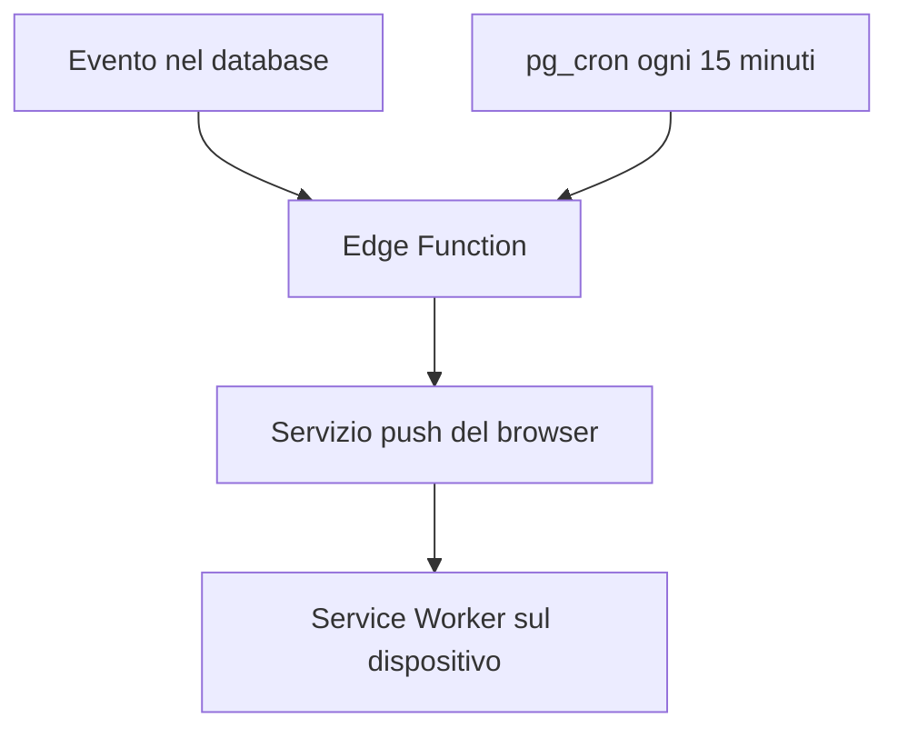

#  FamilyHub

PWA per organizzare faccende domestiche, lista della spesa e appuntamenti familiari, con sincronizzazione in tempo reale, notifiche push e un sistema di inviti via link, codice o QR code per far entrare subito tutta la famiglia.

## Stack

- **Frontend**: React + Vite + React Router, build come PWA installabile (service worker personalizzato con `vite-plugin-pwa` in modalità `injectManifest`)
- **Backend**: Supabase — Postgres, Auth, Realtime, Edge Functions (Deno), `pg_cron`, `pg_net`, Vault
- **Notifiche push**: standard Web Push (VAPID) — nessuna dipendenza da Firebase o altre piattaforme esterne
- **Inviti**: link dinamico e QR code generati e scansionati interamente in-app (`qrcode.react`, `@yudiel/react-qr-scanner`) — anche qui nessun servizio terzo
- **Hosting**: Vercel per il frontend, Supabase per dati/auth/funzioni

Ambienti separati: branch `main` → produzione, branch `staging` → staging, ciascuno con il proprio progetto Supabase e il proprio deployment Vercel.

## Struttura del progetto

```
FamilyHub/
├── supabase/
│   ├── schema.sql                  # Schema iniziale (solo tabelle base — vedi nota sotto)
│   ├── config.toml                 # Config CLI Supabase
│   ├── Migrations/                  # Migrazioni numerate, applicate manualmente su staging poi produzione
│   │   ├── 1.0_schema_iniziale.sql
│   │   ├── 1.1_fix_policy_famiglie.sql
│   │   ├── 1.2_modified_cofirmation_email.txt
│   │   ├── 1.3_modified_site_URL.txt
│   │   ├── 2.0_notifiche_push_schema.sql          # Tabelle push_subscriptions, notifiche_log
│   │   ├── 2.2_trigger_nuovo_utente.sql           # Trigger su profili + helper Vault (get_service_role_key)
│   │   ├── 2.3_fix_sicurezza_service_role_key.sql
│   │   ├── 2.4_trigger_assegnazioni.sql.sql       # Faccende assegnate + nuovi partecipanti evento
│   │   ├── 2.5_promemoria_cron.sql                # pg_cron ogni 15 minuti
│   │   ├── 2.6_trigger_eliminazioni_completamenti.sql
│   │   ├── 2.7_niente_autonotifiche.sql           # Nessuna notifica per azioni fatte su se stessi
│   │   ├── 2.8_elimina_profilo.sql.sql            # RLS: un utente può eliminare il proprio profilo
│   │   ├── 2.9_cascade_eliminazione_profilo.sql   # created_by/aggiunto_da → null invece di bloccare la delete
│   │   ├── 3.0_trigger_uscita_famiglia.sql        # Notifica anche quando un membro abbandona la famiglia
│   │   └── 3.1_realtime_profili.sql               # profili in supabase_realtime (membri live)
│   └── functions/                   # Edge Function (Deno), deploy via Supabase CLI
│       ├── _shared/webpush.ts       # Invio Web Push condiviso: timeout per invio + pulizia sottoscrizioni scadute
│       ├── notify-nuovo-utente/      # Entrata E uscita da una famiglia
│       ├── notify-assegnazione/
│       ├── notify-promemoria/
│       └── notify-eliminazione-completamento/
├── src/
│   ├── lib/
│   │   ├── supabase.js              # Client Supabase
│   │   ├── AuthContext.jsx          # Gestione sessione utente e profilo
│   │   ├── famiglie.js              # trovaFamigliaDaCodice() — helper condiviso da setup e inviti
│   │   ├── pushNotifications.js     # Sottoscrizione push lato client
│   │   └── version.js               # Versione app, letta da package.json
│   ├── pages/
│   │   ├── Login.jsx
│   │   ├── SetupFamiglia.jsx        # Crea famiglia, o entra con codice / scanner QR
│   │   ├── UnisciFamigliaInvito.jsx # Onboarding da link/QR per chi non ha ancora un profilo
│   │   ├── GestisciInvito.jsx       # Gestisce un link/QR aperto da chi è già in una famiglia
│   │   ├── Faccende.jsx
│   │   ├── Spesa.jsx
│   │   ├── Calendario.jsx
│   │   └── Profilo.jsx              # Membri in tempo reale, notifiche, inviti, uscita/abbandono
│   ├── components/
│   │   ├── NavBar.jsx
│   │   ├── ConfermaModal.jsx        # Modal riutilizzabile per le conferme (anche in variante "pericolosa")
│   │   ├── AvvisoModal.jsx          # Modal riutilizzabile puramente informativo
│   │   ├── InvitaModal.jsx          # Codice, link dinamico, QR code, copia e condivisione
│   │   └── ScannerQR.jsx            # Scansione QR da fotocamera, usata in SetupFamiglia
│   ├── styles/
│   │   └── global.css
│   ├── sw.js                         # Service worker personalizzato (eventi push + notificationclick)
│   ├── App.jsx                       # Gestisce anche il routing degli inviti (?code=...)
│   └── main.jsx
├── index.html
├── vite.config.js                    # Config Vite + PWA (strategia injectManifest)
├── vercel.json                       # Rewrite SPA — necessario perché il tap su una notifica apra le pagine interne
├── package.json
└── package-lock.json
```

> **Nota su `schema.sql`**: contiene solo lo schema iniziale (famiglie, profili, faccende, liste/elementi spesa, appuntamenti). Non è più "lo schema completo": tabelle, funzioni e trigger delle notifiche e degli inviti vivono nelle migrazioni `2.x` e `3.x`. Per creare un ambiente da zero servono `schema.sql` **e** tutte le migrazioni in `Migrations/` eseguite in ordine numerico.
>
> Il file `2.1_creazione_edge_function_(clode).txt` è vuoto — un residuo della numerazione, sicuro da cancellare.

## Come funziona il modello dati

- **famiglie**: ogni nucleo familiare ha un record con un `codice_invito` univoco
- **profili**: collegato a `auth.users`, ogni persona appartiene a una famiglia (`famiglia_id`)
- **faccende**, **liste_spesa/elementi_spesa**, **appuntamenti**: tutto filtrato per `famiglia_id`
- **push_subscriptions**: una riga per dispositivo/browser con le notifiche attive, legata a `profilo_id`
- **notifiche_log**: traccia i promemoria già inviati, per evitare invii duplicati quando il controllo schedulato gira più volte
- **Row Level Security**: ogni utente vede/modifica solo i dati della propria famiglia (o le proprie sottoscrizioni/notifiche)
- **Realtime**: le tabelle principali — inclusa `profili`, dalla migration 3.1 — sono in `supabase_realtime`, quindi ogni modifica (anche l'ingresso o l'uscita di un membro) si propaga istantaneamente a tutti i dispositivi connessi

## Sistema di notifiche push

Standard Web Push (VAPID) end-to-end, coerente con la scelta di non avere altri "server da gestire" al di fuori di Supabase e Vercel.



Le policy RLS impediscono a un utente di leggere le sottoscrizioni di qualcun altro. Le Edge Function usano invece la Service Role Key per leggerle tutte quando devono inviare una notifica: quella chiave non gira mai lato client, resta in Vault (per i trigger SQL) e nei secret delle funzioni (per le funzioni stesse).

### Cosa notifica cosa

| Evento | Meccanismo | Destinatari |
|---|---|---|
| Nuovo utente entra in famiglia | Trigger su `INSERT` in `profili` | Tutti gli altri membri della famiglia |
| Un membro abbandona la famiglia | Trigger su `DELETE` in `profili` | Tutti gli altri membri della famiglia |
| Faccenda assegnata (o riassegnata) | Trigger su `INSERT`/`UPDATE` `faccende` | L'assegnatario — nessuna notifica se te la assegni da solo |
| Aggiunto a un evento | Trigger su `UPDATE` `appuntamenti` (nuovi `partecipanti`) | Solo i nuovi partecipanti aggiunti, mai chi crea l'evento |
| Promemoria evento | `pg_cron` ogni 15 min: 24h prima e all'orario di inizio | Tutti i partecipanti |
| Promemoria faccenda | `pg_cron` ogni 15 min: 24h prima e il giorno della scadenza | L'assegnatario |
| Evento eliminato | Trigger su `DELETE` `appuntamenti` | I partecipanti, tranne chi ha eliminato |
| Faccenda eliminata | Trigger su `DELETE` `faccende` | L'assegnatario, tranne se elimina la propria |
| Faccenda completata | Trigger su `UPDATE` `faccende` (`fatto` → true) | L'assegnatario, tranne se la completa lui stesso |

### Edge Function

| Funzione | Invocata da | Cosa fa |
|---|---|---|
| `notify-nuovo-utente` | Trigger `su_profilo_famiglia` (insert o delete su `profili`) | Notifica gli altri membri della famiglia, sia per un ingresso sia per un'uscita |
| `notify-assegnazione` | Trigger su faccende/appuntamenti | Notifica l'assegnatario o i nuovi partecipanti |
| `notify-promemoria` | `pg_cron` (job `controlla-promemoria`) | Controlla scadenze/eventi imminenti, usa `notifiche_log` per non duplicare |
| `notify-eliminazione-completamento` | Trigger su eliminazioni/completamento | Notifica chi è coinvolto, escludendo chi ha eseguito l'azione |
| `_shared/webpush.ts` | Non è una funzione a sé | Invio Web Push riusabile: timeout di 8s per sottoscrizione, pulizia automatica di quelle scadute (404/410) |

### Compatibilità iOS/Safari

Su iPhone le notifiche funzionano solo se l'app è installata sulla schermata Home (Condividi → Aggiungi alla schermata Home) — Safari non le supporta se l'app resta aperta solo nel browser.

## Profilo

La schermata **Profilo** mostra un avatar con l'iniziale del nome, il nome della famiglia e l'elenco dei membri, aggiornato in tempo reale: se qualcuno entra o esce, la lista cambia da sola su tutti i dispositivi (anche nelle schermate Faccende e Calendario, dove il nome dei membri viene mostrato accanto alle assegnazioni). Da qui si attiva/disattiva la notifica push con uno switch (con una piccola rotella mentre la richiesta è in corso), si apre l'invito per un nuovo membro, e si eseguono le due azioni sull'account: uscire e abbandonare la famiglia. In fondo alla pagina — e anche nella schermata di caricamento iniziale — è indicata la versione dell'app, letta direttamente da `package.json`.

### Abbandonare la famiglia

È un'azione distruttiva, quindi richiede conferma tramite `ConfermaModal` in variante "pericolosa" (la stessa usata per l'uscita dall'account). Prima di eliminare il profilo, l'app pulisce i riferimenti che lascerebbe in giro: rimuove l'assegnazione dalle proprie faccende (`assegnato_a` → `null`) e si toglie dall'elenco `partecipanti` degli eventuali appuntamenti a cui partecipava. Il profilo viene poi eliminato per davvero — la RLS permette a ognuno di eliminare solo il proprio (migration 2.8) — e grazie alla migration 2.9 le faccende, la spesa e gli eventi creati in passato restano intatti: perdono solo il riferimento a chi li ha creati, invece di bloccare la cancellazione. Gli altri membri ricevono una notifica push dell'uscita, e chi abbandona può sempre rientrare in un secondo momento con un nuovo invito (l'eventuale sottoscrizione alle notifiche, cancellata insieme al profilo, viene ripristinata in automatico se le riattiva).

## Sistema di inviti

Ogni famiglia ha un `codice_invito` univoco, che è anche la base del link dinamico `<dominio>/join?code=<codice>` — costruito al volo con `window.location.origin`, quindi punta sempre all'ambiente giusto (staging o produzione) senza bisogno di configurazione.

### Invitare un nuovo membro

Dal Profilo, il pulsante **Invita un nuovo membro** apre un modal (`InvitaModal`) con:

- il codice manuale, da leggere e digitare a mano;
- il link e il relativo **QR code** (generato con `qrcode.react`), da far inquadrare con la fotocamera;
- un pulsante **Copia link**, con un fallback che funziona anche su iOS e nelle WebView dove la Clipboard API moderna non è disponibile;
- un pulsante **Condividi**, che usa la Web Share API nativa del dispositivo quando è supportata (altrimenti copia semplicemente il link).

### Entrare con un link, un codice o un QR

Chi vuole entrare in famiglia ha tre strade equivalenti: digitare il codice a mano nella schermata "Entra in famiglia", aprire direttamente il link ricevuto, oppure toccare **Scansiona QR** nella stessa schermata — la fotocamera (via `@yudiel/react-qr-scanner`) legge il codice dal QR e lo porta esattamente sullo stesso percorso `/join?code=...` di un link cliccato, così la logica di gestione resta unica.

Cosa succede quando il link/QR viene aperto dipende da chi lo apre:

| Situazione | Cosa vede |
|---|---|
| Non ha ancora fatto l'accesso | La schermata di login; una volta autenticato, il flusso riprende da solo con lo stesso codice |
| Ha un account ma non è ancora in nessuna famiglia | Una schermata di benvenuto dedicata: basta inserire il nome per entrare subito |
| È già in quella stessa famiglia | Un avviso: "Sei già in questa famiglia" |
| È già in un'altra famiglia | Un avviso che spiega di dover prima abbandonare quella attuale dal Profilo |
| Il codice non è (più) valido | Un avviso di codice non valido, con la possibilità di creare o entrare in un'altra famiglia manualmente |

Questi avvisi usano `AvvisoModal`, un secondo componente riutilizzabile accanto a `ConfermaModal`, pensato per i messaggi puramente informativi: un solo pulsante "Ho capito" per chiuderli.

> La scansione del QR richiede l'accesso alla fotocamera: funziona solo in contesti sicuri (HTTPS su staging/produzione, oppure `localhost` in sviluppo) e con il permesso concesso dal browser.

## Setup passo-passo

### 1. Crea progetto Supabase

1. Vai su [supabase.com](https://supabase.com) → crea account gratuito → "New Project" (uno per staging, uno per produzione)
2. Nel **SQL Editor**, esegui in ordine: tutto `supabase/schema.sql`, poi ogni file `.sql` dentro `supabase/Migrations/` in ordine numerico (i due file `.txt` sono annotazioni, non SQL da eseguire)
3. In **Project Settings → API**, copia `Project URL` e `anon public key`

### 2. Genera le chiavi VAPID

Una tantum, le stesse chiavi vanno bene per staging e produzione:
```bash
npx web-push generate-vapid-keys --json
```
Conserva pubblica e privata in un posto sicuro — non si committano mai.

### 3. Configura il progetto locale

```bash
git clone <url-del-repo>
cd FamilyHub
npm install
```

Crea un file `.env` nella root con:
```
VITE_SUPABASE_URL=<project-url>
VITE_SUPABASE_ANON_KEY=<anon-public-key>
VITE_VAPID_PUBLIC_KEY=<chiave-pubblica-vapid>
```

### 4. Configura Supabase CLI ed Edge Function

```bash
npm install -g supabase
supabase login
supabase link --project-ref <project-ref>
```

Imposta i secret delle funzioni:
```bash
supabase secrets set VAPID_PUBLIC_KEY=<chiave-pubblica> VAPID_PRIVATE_KEY=<chiave-privata> VAPID_SUBJECT=mailto:<tua-email>
```

Nel dashboard Supabase, in **Project Settings → Vault**, crea un secret chiamato `service_role_key` con valore la Service Role Key del progetto (serve ai trigger SQL per chiamare le Edge Function).

Distribuisci le funzioni:
```bash
supabase functions deploy notify-nuovo-utente
supabase functions deploy notify-assegnazione
supabase functions deploy notify-promemoria
supabase functions deploy notify-eliminazione-completamento
```

Nelle migrazioni `2.2`, `2.4`, `2.5`, `2.6`, `2.7` e `3.0` l'URL delle Edge Function è già quello del progetto staging attuale — per un ambiente nuovo, sostituisci il project-ref nell'URL prima di eseguirle.

### 5. Test in locale

```bash
npm run build
npm run preview
```
Le notifiche push funzionano in modo affidabile solo su build di produzione, non su `npm run dev`.

### 6. Deploy su Vercel

1. Pusha il progetto su GitHub
2. Vai su [vercel.com](https://vercel.com) → "New Project" → importa il repo (un progetto per `main`, uno per `staging`)
3. In **Environment Variables** aggiungi `VITE_SUPABASE_URL`, `VITE_SUPABASE_ANON_KEY` e `VITE_VAPID_PUBLIC_KEY`
4. `vercel.json` è già nel repo e gestisce il rewrite necessario per il routing SPA — non serve configurarlo a mano
5. Deploy → ottieni un URL pubblico HTTPS

### 7. Conferma email Supabase (facoltativo)

Su Supabase, in **Authentication → Providers → Email**, puoi disattivare la conferma email per velocizzare i test in famiglia, oppure lasciarla attiva per maggiore sicurezza.

## Primo utilizzo

1. Il primo familiare si registra e crea la famiglia (sceglie un nome) → ottiene un **codice invito**
2. Va su **Profilo → Invita un nuovo membro** per condividere codice, link o QR code, e per attivare le notifiche push
3. Gli altri familiari si registrano (o accedono) e aprono il link/QR ricevuto, oppure scelgono "Entra in famiglia" inserendo il codice a mano o scansionandolo — chi ha le notifiche attive viene avvisato del nuovo arrivo
4. Tutti vedono e modificano le stesse liste in tempo reale — inclusi i membri della famiglia — e ricevono notifiche su assegnazioni, promemoria, eliminazioni, completamenti e su chi entra o esce dal gruppo

## Manutenzione: ripulire l'ambiente di test

Utile su staging quando si accumulano account e dati di prova. Da eseguire nel SQL Editor di Supabase — **mai su produzione**, l'operazione non è reversibile.

Reset completo (utenti compresi):
```sql
begin;
delete from elementi_spesa;
delete from liste_spesa;
delete from notifiche_log;
delete from push_subscriptions;
delete from faccende;
delete from appuntamenti;
delete from profili;
delete from famiglie;
delete from auth.users;
commit;
```

Reset leggero (mantiene utenti, profili e famiglie):
```sql
begin;
delete from elementi_spesa;
delete from liste_spesa;
delete from faccende;
delete from appuntamenti;
delete from notifiche_log;
commit;
```

## Sicurezza

- RLS attivo su tutte le tabelle, incluse `push_subscriptions` e `notifiche_log` (ognuno vede solo i propri dati)
- Un utente può eliminare (sempre via RLS) solo il proprio profilo; farlo non spezza lo storico di faccende, spesa o eventi creati in passato — i riferimenti (`created_by`, `aggiunto_da`) diventano semplicemente `null`
- `get_service_role_key()` ha i permessi di esecuzione revocati da `public`, `anon` e `authenticated` — richiamabile solo dalle funzioni `security definer` dei trigger
- La Service Role Key vive solo in Vault (per SQL) e nei secret delle Edge Function — mai nel codice, nel repo o lato client
- Le chiavi VAPID private restano solo nei secret delle Edge Function
